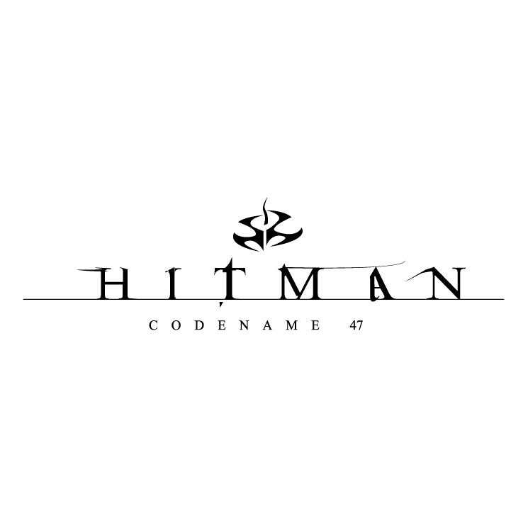

# Hitman: Codename 47



## Project
HMC47 is an open source implementation of IO Interactive's [Hitman: Codename 47](https://en.wikipedia.org/wiki/Hitman:_Codename_47) from 2000.

## Goals
There are multiple goals this project tries to achieve:
- [x] Learn how games were made in an era when things had to be done in the code, and not through fancy game engines like today.
- [ ] Have a fully playable game implemented end-to-end, including resource management, audio, and video rendering, as well as support of large screen resolutions.
- [ ] Eventually, to support 64-bit compilation for modern systems.

## Code
```
git clone --recurse-submodules https://github.com/americusmaximus/HMC47
```

## Requirements & Dependencies
1. [Microsoft Visual Studio](https://visualstudio.microsoft.com/downloads/)
2. [Microsoft DirectX 7.0](https://archive.org/details/dx7sdk-7001)
2. [ZLib](https://github.com/madler/zlib)

## Modules

### ✔ Hitman
A simple game launcher that loads the system module and passes the control flow execution to it.

### ✔ Direct Play
The Direct Play module serves as a simple wrapper around Microsoft DirectPlay interface.

### ✔ Globals
Globals module serves as a glue for DLL linking of a few game-wide objects used to communicate between different part of the game for a multitude of reasons.

### Sound
The Sound module is a sound management module that handles sound and sound effects output via DirectSound and EAX.

### System
System module owns creation and management of the objects that are then being used by other modules via Globals to communicate with each other. These objects include functionality that glues different modules together, and provide low-level functionality such as tracked memory allocation, access to zip files, and various output.

### ✔ System Probe
System Probe is a module that is responsible for querying system graphics capabilities and providing the recommended graphics settings back to the game. It is used only in the graphics settings screen upon user request.

### ✔ StartW
StartW application is a command-line tool to start any other application while properly passing command-line arguments to the new process.

## Third-Party Modules

### ✔ EAX
EAX 2 Wrapper from Creative Technolody for Environmental Audio Extensions 2.

## Thanks
1. [0danny](https://github.com/0danny/re47) for some reverse engineering of the game files.
2. [AdrienTD](https://github.com/AdrienTD/c47edit) for the game scene editor.
3. [SIGMA FEDERATION](https://github.com/sigmaco/a3d-sdk) for Aureal A3D SDK.

## Legal
1. This is not a complete game. Please purchase software you like!
2. The source code in this repository is mostly produced by reverse engineering the original binaries. There are a couple of exceptions for reverse engineering under DMCA -- documentation, interoperability, fair use. See goals section for the interoperability and fair use cases. The documentation is needed to support those. Also please see an article about [software preservation](https://en.wikipedia.org/wiki/Digital_preservation).
3. Hitman, Hitman: Codename 47, IO Interactive, Eidos Interactive, Aureal, A3D, EAX, DirectX, OpenGL, and others are trademarks of their respective owners.
